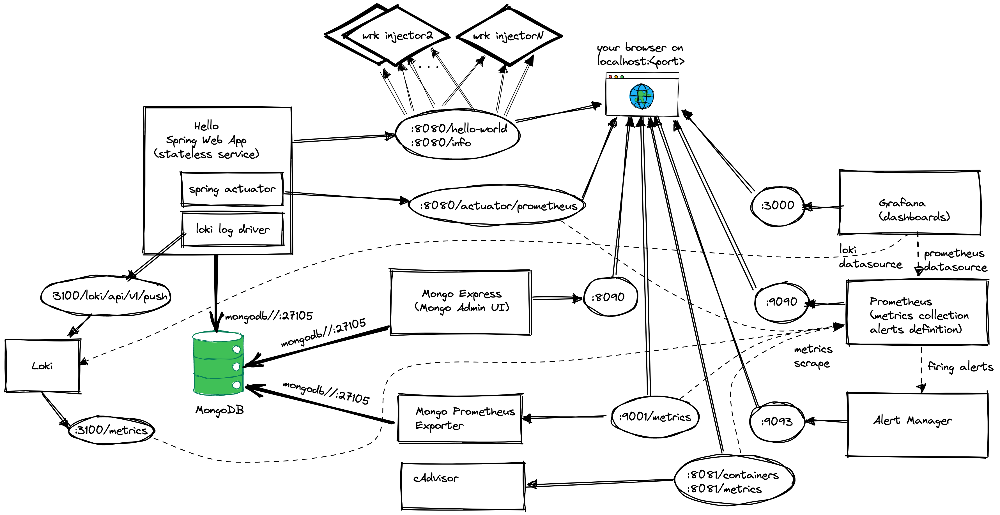

# Prereqs
Install loki logging driver docker plugin
```
docker plugin install grafana/loki-docker-driver:2.4.1 --alias loki --grant-all-permissions
```

# Monitoring Stack

## Start monitoring layer
```
./start.sh
```



App Metrics
- prom metrics [http://localhost:8080/actuator/prometheus)](http://localhost:8080/actuator/prometheus)

cAdvisor (container metrics exporter)
- UI [http://localhost:8081/containers](http://localhost:8081/containers)
- prom metrics [http://localhost:8081/metrics](http://localhost:8081/metrics)

Prometheus
- [http://localhost:9090/](http://localhost:9090/)

Grafana
- [http://localhost:3000/](http://localhost:3000/)

## Prometheus
* Check which targets is Prometheus monitoring:
  * http://localhost:9090/targets
* Plot metrics in Prometheus
  * Navigate to: http://localhost:9090
  * Invoke the application endpoints a couple of times so they start generating metrics:
    * http://localhost:8080/hello-world
    * http://localhost:8080/info
  * Wait 15s (default scrape interval)  
  * Paste `invocation_count_total{endpoint="hello"}` and choose Execute and Graph
  * Paste `invocation_duration_seconds_max{endpoint="info"}` and choose Execute and Graph


## Grafana
* Log in with `admin:admin` in Grafana UI
  * http://localhost:3000
* Add Prometheus datasource:
  * From Settings/Datasources or http://localhost:3000/datasources
  * Use as URL: http://prometheus:9090 
* Create a dashboard to plot invocation_count_total:
  * From the __+__ sign choose "Create -> Dashboard -> Add New Panel"
  * Select `Prometheus` as datasource for the panel, and paste `invocation_count_total{endpoint="hello"}`

# Start Perf test

```
docker-compose --profile perf up -d --remove-orphans --scale wrk-injector-info-perf=5
```

## Stop monitoring layer
```
./stop.sh
```
